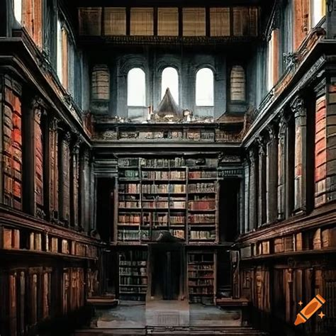

# 🏛️ Terror en el Museo

<div align="center">
  
  
  [](https://developer.mozilla.org/en-US/docs/Web/JavaScript)
  [](https://developer.mozilla.org/en-US/docs/Web/CSS)
  [](https://developer.mozilla.org/en-US/docs/Web/HTML)
</div>

## 📖 La Historia

Una noche oscura en el Museu Nacional d'Art de Catalunya... Las sombras cobran vida, las pinturas respiran, y las estatuas observan cada uno de tus movimientos. ¿Podrás descubrir los secretos que oculta el museo y sobrevivir para contarlo?

### 🌟 Características Destacadas

- **Historia Ramificada**: Más de 20 escenas únicas con múltiples finales
- **Atmósfera Inmersiva**: Efectos visuales y sonoros que te sumergen en el terror
- **Decisiones Críticas**: Cada elección puede ser la diferencia entre la vida y la muerte
- **Diseño Responsivo**: Experiencia optimizada para cualquier dispositivo

## 🎮 Experiencia de Juego

### Elementos Visuales
- **Fondos Dinámicos**: Imágenes atmosféricas que cambian con cada escena
- **Efectos de Niebla**: Animaciones sutiles que crean profundidad
- **Texto Dinámico**: Efectos de brillo y resplandor que intensifican el horror
- **Interfaz Oscura**: Diseño minimalista que mantiene la tensión

### Efectos de Sonido
- **Música Ambiental**: Banda sonora inquietante que aumenta la inmersión
- **Control de Audio**: Sistema intuitivo para ajustar la experiencia sonora

## 🛠️ Desarrollo

Este proyecto fue desarrollado con un enfoque en la inmersión y la narrativa. Algunas decisiones técnicas clave:

### Tecnologías Utilizadas
```javascript
const techStack = {
  frontend: ['HTML5', 'CSS3', 'JavaScript ES6+'],
  design: ['CSS Animations', 'Dynamic Backgrounds', 'Responsive Layout'],
  audio: ['HTML5 Audio API', 'Custom Sound Controls'],
  effects: ['CSS Filters', 'SVG Animations', 'Dynamic Text Effects']
};
```

### Estructura del Proyecto
```
📦 CYOA Monstrous Mystery
 ┣ 📂 assets/
 ┃ ┣ 📂 img/
 ┃ ┃ ┣ 📄 proxy-image.jpg    # Escena de la biblioteca
 ┃ ┃ ┣ 📄 proxy-image2.jpg   # Galería gótica
 ┃ ┃ ┣ 📄 proxy-image3.jpg   # Corredor oscuro
 ┃ ┃ ┣ 📄 proxy-image4.jpg   # Sala de pinturas
 ┃ ┃ ┣ 📄 proxy-image5.jpg   # Sala de restauración
 ┃ ┃ ┣ 📄 proxy-image6.jpg   # Sala de estatuas
 ┃ ┃ ┗ 📄 proxy-image7.jpg   # Entrada del museo
 ┃ ┗ 🎵 EerieMusic.mp3       # Música ambiental
 ┣ 📄 index.html             # Archivo principal
 ┗ 📄 README.md              # Documentación
```

## 🚀 Cómo Empezar

1. **Clona el Repositorio**
   ```bash
   git clone https://github.com/tu-usuario/terror-en-el-museo.git
   ```

2. **Abre el Juego**
   - Navega hasta la carpeta del proyecto
   - Abre `index.html` en tu navegador
   - ¡Prepárate para la aventura!

3. **Controles**
   - 🖱️ Clic en las opciones para avanzar
   - 🔊 Botón de sonido para controlar el audio
   - 🔄 "Volver a empezar" para reiniciar

## 💡 Características Técnicas

### Efectos Visuales Innovadores
```css
/* Ejemplo de efecto de niebla */
.fog-overlay {
  animation: fog 20s linear infinite;
  background: url('data:image/svg+xml,...');
  opacity: 0.1;
}
```

### Sistema de Navegación
```javascript
// Ejemplo de sistema de escenas
function updateScene(sceneId) {
  currentScene = sceneId;
  renderScene();
}
```

## 🎯 Próximas Mejoras

- [ ] Nuevas rutas y finales alternativos
- [ ] Sistema de inventario expandido
- [ ] Efectos visuales adicionales
- [ ] Más variedad de música ambiental
- [ ] Modo de juego en inglés

## 🤝 Contribuciones

¿Tienes ideas para mejorar la experiencia? ¡Las contribuciones son bienvenidas!

1. Fork el proyecto
2. Crea tu rama de características
3. Commit tus cambios
4. Push a la rama
5. Abre un Pull Request

## 📜 Licencia

Este proyecto está bajo la Licencia MIT. Consulta el archivo `LICENSE` para más detalles.

## 👥 Créditos

- **Desarrollo y Diseño**: [Tu Nombre]
- **Imágenes**: Generadas con IA para uso exclusivo en este proyecto
- **Música**: Composición original para Terror en el Museo
- **Inspiración**: Museu Nacional d'Art de Catalunya

---

<div align="center">
  <p>Creado con 💀 y ☠️ por [Tu Nombre]</p>
  <p>¿Te atreves a entrar al museo?</p>
</div> 